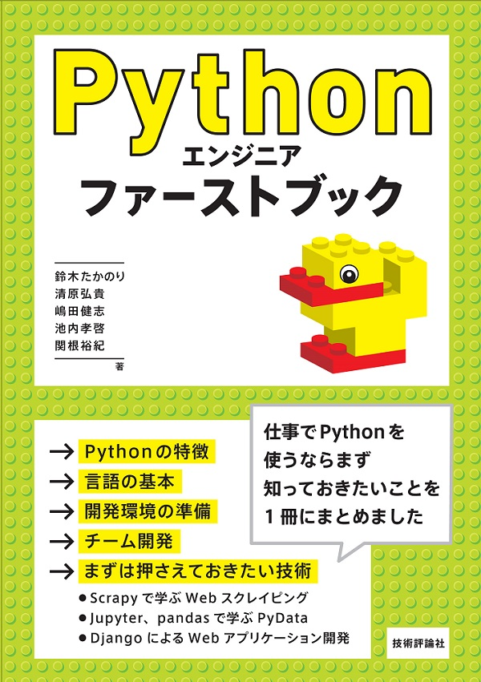

# Pythonエンジニア ファーストブックのサンプルコード

[Pythonエンジニア ファーストブック](http://gihyo.jp/book/2017/978-4-7741-9222-2 "Pythonエンジニア ファーストブック：書籍案内｜技術評論社")

* 2017年9月9日発売
* 鈴木たかのり，清原弘貴，嶋田健志，池内孝啓，関根裕紀　著
* A5判／328ページ
* 定価（本体2,400円＋税）
* ISBN 978-4-7741-9222-2

## 目次

* 第1章 Pythonの動向
  * 1.1 Pythonの特徴
  * 1.2 Pythonの歴史
  * 1.3 Pythonのコミュニティ
* 第2章 最低限知っておきたいPython言語の基本
  * 2.1 Pythonをはじめよう
  * 2.2 Pythonのデータ型［基本編］
  * 2.3 Pythonのデータ型［コレクション編］
  * 2.4 ファイル操作とモジュール
* コラム 便利な標準ライブラリ，サードパーティ製パッケージ
* 第3章 開発環境とチーム開発
  * 3.1 開発環境とチーム開発のポイント
  * 3.2 GitとGitHub
  * 3.3 venv
  * 3.4 テストと品質
  * 3.5 Sphinx
  * 3.6 PyCharm
* 第4章 スクレイピング
  * 4.1 スクレイピングとは
  * 4.2 サードパーティ製パッケージを使ってスクレイピングに挑戦
  * 4.3 スクレイピングフレームワークScrapy入門
* 第5章 PyData入門ガイド
  * 5.1 PyDataとは
  * 5.2 はじめてのJupyter Notebook
  * 5.3 実践 レゴデータ分析［データ探索編］
  * 5.4 実践 レゴデータ分析［データ可視化，分析編］
  * 5.5 Anaconda環境の利用
  * 5.6 PyDataパッケージガイド
* 第6章 Webアプリケーション開発
  * 6.1 Webフレームワーク入門
  * 6.2 Djangoアプリケーションの作成と初期設定
  * 6.3 ビュー，テンプレート，ルーティング
  * 6.4 モデル，管理サイト
  * 6.5 レゴ管理アプリケーションの作成
* 次のステップ
